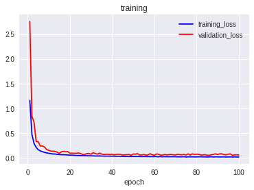
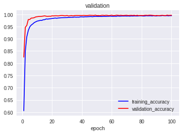

<h3 align="center">
  
</h3>

# Digit Recognizer

Python Jupyter Notebook with **Convolutional Neural Network** digit recognizer implemented in **Keras**. It's [Google Colab](https://colab.research.google.com/) ready.

Part of [Kaggle competition](https://www.kaggle.com/c/digit-recognizer). 

Submitted [Kernel](https://www.kaggle.com/greg115/digit-recognizer-keras-cnn-0-995) with 0.995 score.

Check out corresponding Medium article:

[Digit Recognizer - Introduction to Kaggle Competitions with Image Classification Task (0.995)](https://towardsdatascience.com/digit-recognizer-introduction-to-kaggle-competitions-with-image-classification-task-0-995-268fa2b90e13)

## Data

**Dataset:** [MNIST Handwritten digits](https://www.kaggle.com/c/digit-recognizer/data)

**Description:** Classification of handwritten digits, 10 classes (0-9).

**Training:** 37.8k (0.9) images

**Validation:** 4.2k (0.1) images

**Testing:** 28k images

## Model

	_________________________________________________________________
	Layer (type)                 Output Shape              Param #   
	=================================================================
	conv2d_22 (Conv2D)           (None, 28, 28, 32)        832       
	_________________________________________________________________
	conv2d_23 (Conv2D)           (None, 28, 28, 32)        25632     
	_________________________________________________________________
	max_pooling2d_11 (MaxPooling (None, 14, 14, 32)        0         
	_________________________________________________________________
	dropout_7 (Dropout)          (None, 14, 14, 32)        0         
	_________________________________________________________________
	conv2d_24 (Conv2D)           (None, 14, 14, 64)        18496     
	_________________________________________________________________
	conv2d_25 (Conv2D)           (None, 14, 14, 64)        36928     
	_________________________________________________________________
	max_pooling2d_12 (MaxPooling (None, 7, 7, 64)          0         
	_________________________________________________________________
	dropout_8 (Dropout)          (None, 7, 7, 64)          0         
	_________________________________________________________________
	flatten_4 (Flatten)          (None, 3136)              0         
	_________________________________________________________________
	dense_8 (Dense)              (None, 8192)              25698304  
	_________________________________________________________________
	dropout_9 (Dropout)          (None, 8192)              0         
	_________________________________________________________________
	dense_9 (Dense)              (None, 2048)              16779264  
	_________________________________________________________________
	dropout_10 (Dropout)         (None, 2048)              0         
	_________________________________________________________________
	dense_10 (Dense)             (None, 10)                20490     
	=================================================================
	Total params: 42,579,946
	Trainable params: 42,579,946
	Non-trainable params: 0
	_________________________________________________________________

## Training

<h3>
  
</h3>

<h3>
  
</h3>

## Results

Kaggle score: **0.995**

